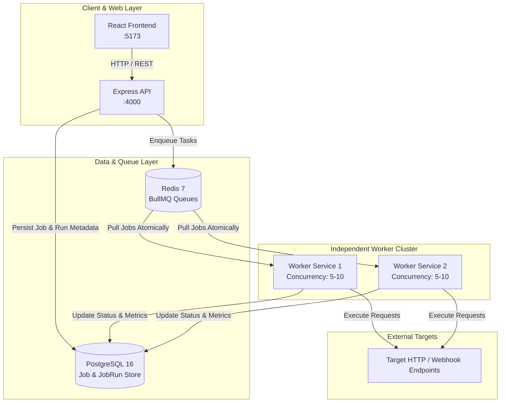

# Distributed Job Scheduler

A distributed background job scheduling and execution system built with Node.js, Express, BullMQ, Redis, PostgreSQL, and React. The platform decouples API request handling from asynchronous worker execution, allowing independent worker processes to pull, execute, and record HTTP/webhook tasks with configurable timeouts, retries, and SSRF protection.

---

## Features

- **Decoupled Architecture**: API service handles scheduling and orchestration, while standalone worker services handle execution.
- **Queue-Based Execution**: BullMQ and Redis manage job buffering, concurrency, and persistent job state.
- **CRON & One-Time Scheduling**: Automatic optimistic claiming for recurring CRON jobs alongside immediate and delayed one-time jobs.
- **HTTP/Webhook Executor**: Executes `GET`, `POST`, `PUT`, `PATCH`, and `DELETE` requests with custom headers, bodies, and configurable timeouts.
- **SSRF Protection**: Pre-flight validation blocking loopback, link-local, private RFC 1918 subnets, and Docker hostnames via IP checks and DNS resolution.
- **Resilient Failure Handling**: Distinguishes non-retryable 4xx errors from retryable 5xx/network errors with exponential backoff.
- **Job Run Observability**: Tracks execution duration, HTTP status codes, error messages, and safely truncated response bodies in PostgreSQL.
- **In-Flight Cancellation**: AbortController-driven termination for active HTTP requests and BullMQ queue removal for waiting runs.
- **Concurrent Worker Scaling**: Multiple worker containers safely consume from shared queues without duplicate executions.
- **Full-Stack Containerization**: Production and development Docker Compose configurations with health checks and automatic Prisma migrations.

---

## Architecture



### Why Workers are Decoupled from the API
Running worker execution in standalone processes prevents long-running network I/O, heavy payloads, or bursty background traffic from starving the Express API event loop. Workers can scale independently based on queue volume without replicating HTTP server overhead.

---

## Job Lifecycle

```text
[Create / Schedule Job]
         │
         ▼
[Prisma creates Job & JobRun (PENDING)]
         │
         ▼
[BullMQ Queue in Redis]
         │
         ▼
[Worker pulls job -> JobRun updated to RUNNING (attempt recorded)]
         │
         ▼
[HttpExecutor executes fetch with AbortController & SSRF check]
         │
    ┌────┴───────────────────────────┬───────────────────────────┐
    ▼                                ▼                           ▼
[2xx Success]                [4xx / SSRF Error]          [5xx / Timeout / Net Error]
    │                                │                           │
    ▼                                ▼                           ▼
JobRun: COMPLETED             JobRun: FAILED             Attempts remaining?
(status, duration, body)      (Permanent config error)    ├── Yes ──> JobRun: RETRYING -> BullMQ Backoff
                                                          └── No  ──> JobRun: FAILED
```

---

## Supported HTTP Jobs

Jobs accept an execution configuration in their JSON payload:

```json
{
  "name": "Sync Customer Webhook",
  "type": "ONE_TIME",
  "executionType": "HTTP",
  "queueName": "default",
  "retryLimit": 3,
  "backoffType": "EXPONENTIAL",
  "backoffDelayMs": 5000,
  "timeoutMs": 15000,
  "payload": {
    "url": "https://api.example.com/webhooks/customers",
    "method": "POST",
    "headers": {
      "X-Service-Source": "job-scheduler"
    },
    "body": {
      "customerId": "cust_12345",
      "action": "sync"
    },
    "timeoutMs": 15000
  }
}
```

- **Supported Methods**: `GET`, `POST`, `PUT`, `PATCH`, `DELETE`
- **Timeouts**: Enforced per-request using `AbortController` (defaults to 30s, max 300s).
- **Body & Header Limits**: Response bodies stored in `JobRun.result` are capped at 32 KB. Sensitive headers (`Authorization`, `Cookie`, `X-Api-Key`) are stripped from logs and run results.

---

## Reliability & Safety

- **SSRF Prevention**: All target URLs are parsed and resolved via DNS before execution. Requests targeting `localhost`, `127.0.0.0/8`, `10.0.0.0/8`, `172.16.0.0/12`, `192.168.0.0/16`, `169.254.0.0/16`, `::1`, or internal Docker hostnames (`postgres`, `redis`, `backend`, `worker`) are rejected immediately.
- **Failure Classification**: Permanent errors (4xx client responses, invalid URLs, SSRF rejections) fail as `UnrecoverableError` without consuming retries. Transient 5xx server errors trigger BullMQ exponential backoff.
- **Worker Recovery**: If a worker process exits unexpectedly, BullMQ's lock renewal (`lockDuration: 30s`, `stalledInterval: 30s`) detects stalled jobs and automatically reassigns them.
- **State Integrity**: Database updates guard against race conditions, ensuring late worker completions never overwrite a `CANCELLED` run.

---

## Tech Stack

| Technology | Purpose |
|---|---|
| **Node.js & TypeScript** | Core backend and worker runtime |
| **Express** | REST API, authentication middleware, and Swagger documentation |
| **BullMQ & Redis** | Distributed queue management, job dispatch, and backoff retries |
| **PostgreSQL 16** | Relational persistence for users, jobs, and execution history |
| **Prisma ORM** | Schema definition, migrations, and type-safe database queries |
| **React & Vite** | Management dashboard interface |
| **Docker & Compose** | Containerized multi-service orchestration |
| **Jest & Supertest** | Automated unit and integration test suites |

---

## Project Structure

```text
distributed-job-scheduler/
├── docker-compose.yml              # Multi-container dev configuration
├── docker-compose.prod.yml         # Production container override
├── .env.example                    # Environment template
├── backend/
│   ├── prisma/
│   │   ├── schema.prisma           # Prisma schema (Job, JobRun, User)
│   │   └── migrations/             # Versioned SQL migrations
│   ├── src/
│   │   ├── config/                 # Env, database, redis, and logger config
│   │   ├── executors/              # HttpExecutor, SSRF validator, registry
│   │   ├── middleware/             # Auth, error, logging, rate-limiting
│   │   ├── modules/
│   │   │   ├── auth/               # User registration and JWT authentication
│   │   │   └── jobs/               # Job CRUD, triggers, cancellation, validation
│   │   ├── queue/                  # BullMQ producers, workers, manager, registry
│   │   ├── utils/                  # Cron parser, password, async handlers
│   │   ├── app.ts                  # Express application setup
│   │   ├── server.ts               # API server entrypoint
│   │   └── worker.ts               # Standalone worker process entrypoint
│   └── tests/
│       ├── unit/                   # Tests for executors, workers, cron, auth
│       └── integration/            # Tests for API routes and live worker queues
└── frontend/                       # React management frontend (Vite)
```

---

## Getting Started

### Prerequisites
- [Docker](https://docs.docker.com/get-docker/) & Docker Compose
- Node.js 20+ (optional, for local development without Docker)

### Running with Docker Compose

1. **Clone the repository**:
   ```bash
   git clone https://github.com/Nishkarshhhhh/distributed-job-scheduler.git
   cd distributed-job-scheduler
   ```

2. **Configure environment variables**:
   ```bash
   cp .env.example .env
   ```

3. **Start the complete stack**:
   ```bash
   docker compose up --build
   ```

### Verified Local Endpoints

| Service | URL | Description |
|---|---|---|
| **Frontend UI** | [http://localhost:5173](http://localhost:5173) | Dashboard interface |
| **API Server** | [http://localhost:4000](http://localhost:4000) | Express REST API |
| **Swagger UI** | [http://localhost:4000/api/docs](http://localhost:4000/api/docs) | Interactive API documentation |
| **Health Check** | [http://localhost:4000/health](http://localhost:4000/health) | API uptime and status probe |

---

## Environment Variables

Copy `.env.example` to `.env` before starting. The `.env` file is excluded from version control.

| Variable | Description | Example |
|---|---|---|
| `POSTGRES_USER` | PostgreSQL username | `scheduler` |
| `POSTGRES_PASSWORD` | PostgreSQL password | `secure_password` |
| `POSTGRES_DB` | Database name | `job_scheduler` |
| `DATABASE_URL` | Prisma connection string | `postgresql://scheduler:pw@localhost:5432/job_scheduler?schema=public` |
| `REDIS_HOST` | Redis hostname | `localhost` (or `redis` in Docker) |
| `REDIS_PORT` | Redis port | `6379` |
| `JWT_SECRET` | Secret key for signing auth tokens | `your_jwt_secret_key` |
| `JWT_EXPIRES_IN` | Token validity duration | `1d` |
| `WORKER_CONCURRENCY` | Concurrent jobs per worker process | `5` |
| `ALLOW_INTERNAL_NETWORK_REQUESTS` | Bypass SSRF checks for private environments | `false` |

---

## API Overview

Interactive documentation is available at `/api/docs`. Verified endpoints include:

- **Authentication**:
  - `POST /api/auth/register` — Create account and receive JWT
  - `POST /api/auth/login` — Authenticate and receive JWT
  - `GET /api/auth/me` — Current authenticated user profile
- **Job Management**:
  - `POST /api/jobs` — Create a one-time or CRON job
  - `GET /api/jobs` — List paginated jobs (scoped to owner or all for admins)
  - `GET /api/jobs/:id` — Retrieve job details
  - `PATCH /api/jobs/:id` — Update job parameters or schedule
  - `DELETE /api/jobs/:id` — Delete a job
  - `POST /api/jobs/:id/trigger` — Trigger an immediate manual execution
  - `POST /api/jobs/:id/pause` — Pause a scheduled job
  - `POST /api/jobs/:id/resume` — Resume a paused job
  - `GET /api/jobs/:id/runs` — Fetch execution history and diagnostic results
  - `POST /api/jobs/:id/cancel` — Cancel active or pending job runs

---

## Testing

The backend includes a comprehensive Jest test suite covering HTTP execution, SSRF validation, BullMQ worker lifecycle transitions, API routes, and multi-worker concurrency.

Run tests locally:
```bash
cd backend
npm test
```

### Verified Test Results
- **Test Suites**: 8 passed, 8 total
- **Tests**: 50 passed, 50 total
- **Failures**: 0
- **Skipped**: 0

---

## Scalability

Multiple worker processes can run simultaneously against the same BullMQ queues. In Docker Compose, workers can be scaled horizontally:

```bash
docker compose up -d --scale worker=3
```

BullMQ coordinates atomic job distribution across all active worker instances via Redis, ensuring each task is processed by exactly one worker without conflicts or duplicates.

---

## Future Improvements

- Additional executor types (e.g. gRPC or script runners in isolated sandbox containers).
- Distributed Pub/Sub cancellation signaling across remote worker nodes.
- OpenTelemetry metrics and Prometheus instrumentation for queue latency and worker throughput.
- Dead-letter queue (DLQ) inspection and manual replay tooling.

---

## License

No license has been specified for this project.
